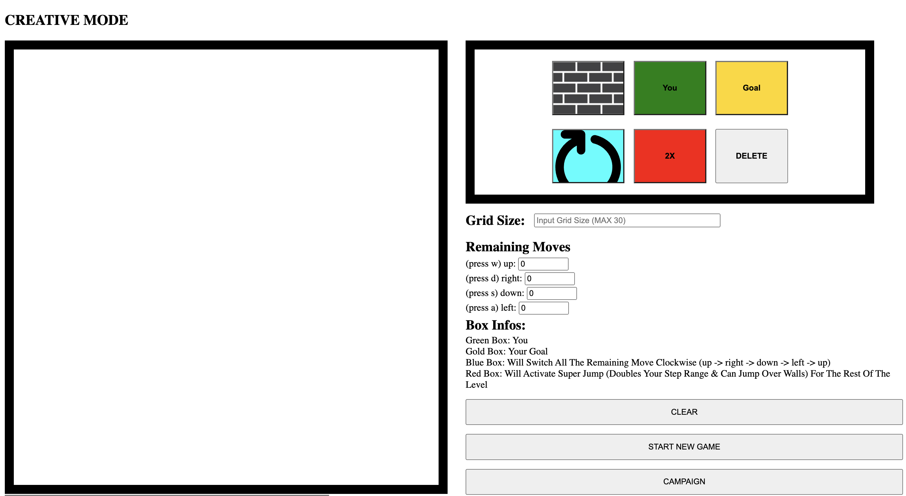
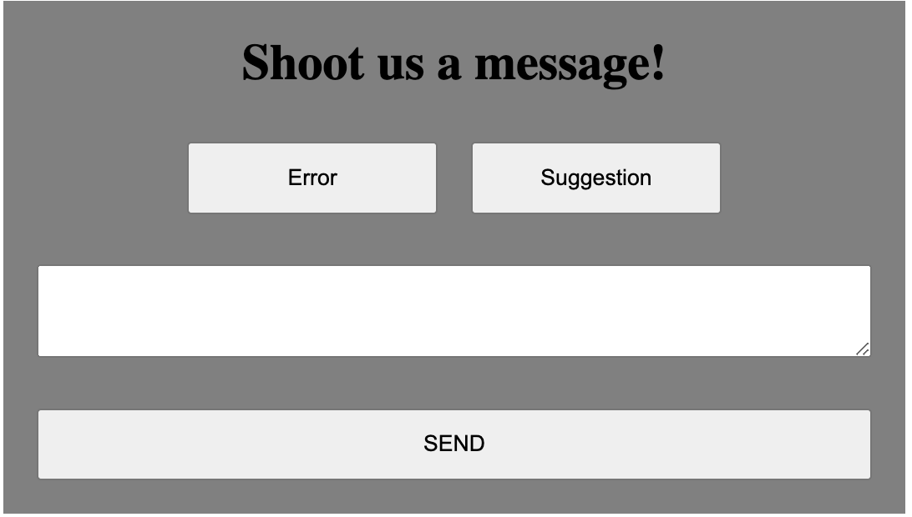

<h3 align="center">Limited Move</h3>

<div align="center">

  []() 
  [](/LICENSE)

</div>

---

<p align="center"> A 2D puzzle game
    <br> 
</p>

## 📝 Table of Contents
- [About](#about)
- [Getting Started](#getting_started)
- [Acknowledgments](#acknowledgement)

## 🧐 About <a name = "about"></a>
A personal 2D puzzle game where you can create your own level in creative mode or solve puzzles in campaign mode using mainly React.js. The player will use their logical thinking to strategize a way to finish the puzzle.
The game will have 5 special boxes:
- Player :
 
- Goal : 

- Wall : 

- ClockWise : 

- 2X : 


The puzzle have 3 campaign level.


The puzzle will also have creative mode, where you can build any puzzle level from you imagination.



In the bottom of the screen there will be message form where you could message me from email instantly, if you have any suggestion or error to report to me.



## 🏁 Getting Started <a name = "getting_started"></a>

### Prerequisites
You would need to have Node.js (v18 or higher) installed on your local machine.

### Installing
First, run the development server:

```bash
npm run dev
# or
yarn dev
```
## 🎉 Acknowledgements <a name = "acknowledgement"></a>
- This project is inspired from [@Memodol](https://memodol.itch.io/controlnotincluded)

Open [http://localhost:3000](http://localhost:3000) with your browser to see the result.
